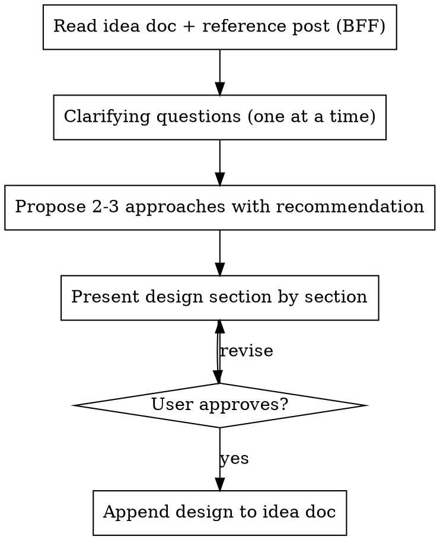

# Brainstorm Post

Turn a raw idea kernel into a fleshed-out post design through conversational exploration.

## Overview

Marshall captures post ideas as raw kernels in `_ideas/writing/`. This skill takes a kernel and develops it into a full post arc through one-question-at-a-time dialogue. The output is an updated idea doc with the design appended (not overwritten) below the original, showing evolution of thinking.

## Process



## Step 1: Context

- Read the idea doc in `_ideas/writing/`
- Read the BFF post (`_posts/2026-03-22-build-friction-fix.md`) as voice reference
- Check CLAUDE.md for voice and anti-patterns
- Note what's already captured vs what needs exploring

## Step 2: Clarifying Questions

Ask one question at a time. Prefer multiple choice when possible. Key areas:

- **Audience:** who is this for?
- **Current thinking:** has the mental model shifted since capture?
- **Central story/hook:** what's the entry point?
- **Relationship to other posts:** standalone, companion, extension?
- **Tone:** prescriptive vs exploratory vs somewhere in between?

Let Marshall brain dump. When he does, listen for the threads and reflect them back before asking the next question. Don't rush to structure.

## Step 3: Propose Approaches

Present 2-3 different structural approaches with trade-offs. Lead with your recommendation and why. These are about the overall shape and entry point of the post, not the content.

## Step 4: Present Design Section by Section

Walk through each section of the post arc. After each section, check: does this land? Revise before moving on.

Sections should name:
- What the section does (its job in the post)
- The key content/ideas in it
- The tone and energy

## Step 5: Append to Idea Doc

**Append, never overwrite.** The original kernel stays. Add a dated separator and the fleshed-out design below it.

Format:
```markdown
---

## fleshed out design (YYYY-MM-DD)

### post arc
#### 1. section name
content...

### tone
### additional influences
### audience
```

## Voice Reminders

- Read and follow CLAUDE.md voice guidance strictly
- The BFF post is the reference point for Marshall's voice
- No em dashes. Ever.
- If it could have been written by any AI, it's wrong
- Exploratory > conclusive. Ship the thinking.
- Let Marshall's brain dumps stay raw. Reflect and shape, don't sanitize.

## Anti-Pattern Check: Hooks

Before proposing any hook or opening anecdote, run it through these filters:

1. **The LinkedIn test:** Could this open a LinkedIn thought leadership post? "I told my team X and watched Y happen." "Last week I noticed Z about my reports." If yes, kill it. Find the real moment.
2. **The specificity test:** Is the hook a generic scenario ("someone experimenting with AI tools") or a specific, felt moment? Generic means you haven't found the entry point yet.
3. **The voice test:** Read the proposed hook against the BFF post opening. Does it sound like Marshall or like a content template?

When a hook fails these checks, don't just tweak the wording. Ask Marshall: "What was the actual moment this idea hit you?" The real hook is in his answer, not in narrative structure.
