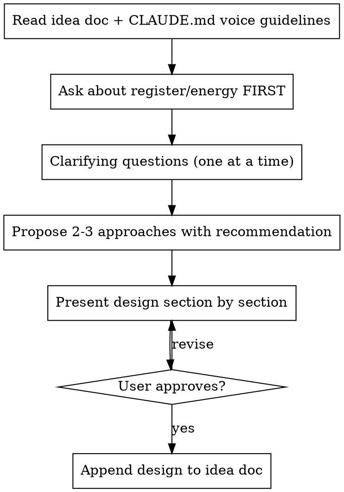

# Brainstorm Post

Turn a raw idea kernel into a fleshed-out post design through conversational exploration.

## Overview

marshall captures post ideas as raw kernels in `_ideas/writing/`. This skill takes a kernel and develops it into a full post arc through one-question-at-a-time dialogue. The output is an updated idea doc with the design appended (not overwritten) below the original, showing evolution of thinking.

## Process



## Step 1: Context

- Read the idea doc in `_ideas/writing/`
- Check CLAUDE.md for voice guidelines (the "marshall contains multitudes" section)
- Note what's already captured vs what needs exploring

## Step 2: Register/Energy (ask FIRST, before anything else)

**This is mandatory and cannot be skipped.** marshall's voice spans a wide range. Before any other question, ask what energy this post carries. Offer the published posts as reference points:

### Prescriptive prompt trap

If marshall's request includes detailed structure, section breakdowns, visual assignments, voice bullets, or output paths, that is NOT permission to skip the register question. Detailed specs still need voice calibration. The more structure he pre-specifies, the more important register becomes, because register is the one thing structure cannot encode.

Do not read a dense prompt as "execute this spec." Read it as "rich input to the brainstorm." The register question comes first regardless. If you catch yourself drafting a full post because the prompt "had everything," stop and back up to the register question.


- **Quiet/minimal** (like hiyaaa-world): short, declarative, arrival energy
- **High energy/manic** (like BFF): stream-of-consciousness, rapid-fire, tangential, unhinged
- **Measured/model-building** (like MEB): calmer, structured, "let me think through this with you"
- **Something else:** let marshall describe it

Do not assume. Do not default to any one register. The answer to this question shapes everything that follows.

## Step 3: Clarifying Questions

Ask one question at a time. Prefer multiple choice when possible. Key areas:

- **Audience:** who is this for?
- **Current thinking:** has the mental model shifted since capture?
- **Central story/hook:** what's the entry point?
- **Relationship to other posts:** standalone, companion, extension?

Let marshall brain dump. When he does, listen for the threads and reflect them back before asking the next question. Don't rush to structure.

## Step 4: Propose Approaches

Present 2-3 different structural approaches with trade-offs. Lead with your recommendation and why. These are about the overall shape and entry point of the post, not the content.

## Step 5: Present Design Section by Section

Walk through each section of the post arc. After each section, check: does this land? Revise before moving on.

Sections should name:
- What the section does (its job in the post)
- The key content/ideas in it
- The tone and energy

## Step 6: Append to Idea Doc

**Append, never overwrite.** The original kernel stays. Add a dated separator and the fleshed-out design below it.

Format:
```markdown
---

## fleshed out design (YYYY-MM-DD)

### post arc
#### 1. section name
content...

### register/energy
### additional influences
### audience
```

## Voice Reminders

- Read and follow CLAUDE.md voice guidance strictly, especially "marshall contains multitudes"
- There is no single reference post. Match the register marshall chose in Step 2.
- No em dashes. Ever.
- If it could have been written by any AI, it's wrong
- Exploratory > conclusive. Ship the thinking.
- Let marshall's brain dumps stay raw. Reflect and shape, don't sanitize.
- If you catch yourself pulling energy/structure from a different post than the chosen register, stop and recalibrate.

## Anti-Pattern Check: Hooks

Before proposing any hook or opening anecdote, run it through these filters:

1. **The LinkedIn test:** Could this open a LinkedIn thought leadership post? "I told my team X and watched Y happen." "Last week I noticed Z about my reports." If yes, kill it. Find the real moment.
2. **The specificity test:** Is the hook a generic scenario ("someone experimenting with AI tools") or a specific, felt moment? Generic means you haven't found the entry point yet.
3. **The voice test:** Does the proposed hook match the register marshall chose for this post? Not BFF's register, not MEB's register, but the one he picked.

When a hook fails these checks, don't just tweak the wording. Ask marshall: "What was the actual moment this idea hit you?" The real hook is in his answer, not in narrative structure.
